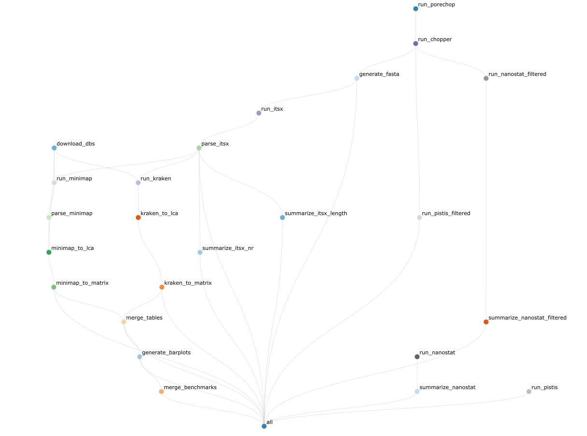

## NanoITS

NanoITS is a classifier for long-read Oxford Nanopore data of the eukaryotic 18S/SSU-ITS1 operon. 

When giving the tool some nanopore long-read data it will:

- Provide a quality report of the raw reads
- Check the reads for adaptors and barcodes and if present trim the reads using porechop
- Remove low-quality and short reads with chopper
- Provide a quality report for the cleaned reads
- Identify and separate the ITS1, ITS2 and 18S rRNA gene using ITSx
- Classify the SSU and/or ITS1/ITS2 gene using kraken2 and/or minimap2 and the Silva and Uniprot database, respectively
- Generate taxonomic barplots and OTU tables

We plan to in the future extend this workflow to also include the 28S/LSU.

For a more detailed explanation, check out [the manual](https://ndombrowski.github.io/NanoITS/). 

Below you can find the full workflow:




## Quick start

To run NanoITs, install conda and use it to installed snakemake  as follows:

```{bash}
mamba create --name snakemake -c conda-forge -c bioconda snakemake=7.32.4 python=3.11.6 tabulate=0.8
```

Afterwards, you can clone the directory from github via:

```{python}
git clone https://github.com/ndombrowski/NanoITS.git
```

Provide your sample names and path to the samples as a comma-separated file, for example, a file looking similar as the one provided in `example_files/mapping.csv`. Sample names should be unique and consist of letter, numbers and `-` only. The barcode column can be left empty as it is not yet implemented. The path should contain the path to your demultiplexed, compressed fastq file.

Adjust `config/config.yaml` to configure the location of your mapping file as well as specify the parameters used by NanoITs.

NanoITs can then be run with:

```{python}
#perform a dry-run to ensure everything is working correctly
snakemake --use-conda --cores <nr_cores> \
  -s <path_to_NanoITS_install>/workflow/Snakefile \
  --configfile config/config.yaml \
  --conda-prefix <path_to_NanoITS_install>/workflow/.snakemake/conda  \
  -np 

#run NanoITS
snakemake --use-conda --cores <nr_cores> \
  -s <path_to_NanoITS_install>/workflow/Snakefile \
  --configfile config/config.yaml \
  --conda-prefix <path_to_NanoITS_install>/workflow/.snakemake/conda  \
  --rerun-incomplete --nolock
```

For a more detailed explanation, check out [the manual](https://ndombrowski.github.io/NanoITS/).

